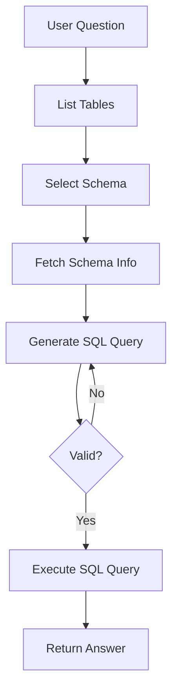

# Information_Retrieval_from_Database_Agent
# Information_Retrieval_from_Database_Agent


This project is a **LangGraph-based Information Retrieval Agent** built using [LangChain](https://docs.langchain.com/) and [LangGraph](https://docs.langchain.com/langgraph/). It allows users to query relational databases using natural language. The agent fetches relevant schema information, generates and validates SQL queries, and executes them on a SQLite database. It also includes detailed logging and error handling.

---

## ⚙️ Features

* 🗣️ Natural language to SQL query generation
* ✅ Full table and schema extraction before query generation
* 🔠 Query validation and correction if needed
* ⚡ LangGraph-powered multi-step reasoning flow
* 🔎 LLaMA3 model support (via ChatGroq)
* 📊 Real SQLite database support via LangChain `SQLDatabase`
* 🔗 Custom logging for debugging every step

---

## 📅 Architecture

### LangGraph Flow



### Nodes:

* **first\_tool\_call**: Triggers table listing tool.
* **list\_tables\_tool**: Uses LangChain's `sql_db_list_tables`.
* **model\_get\_schema**: Determines relevant tables using Gemini.
* **get\_schema\_tool**: Calls `sql_db_schema` tool.
* **query\_gen**: Generates SQL query using prompt and LLM.
* **correct\_query**: Validates query using prompt and checks with tool.
* **execute\_query**: Runs the SQL query.

---

## 📁 Project Structure

```
sql_agent/
├── get_sql_data_from_natural_query.py           # Main SQLAgent class with LangGraph logic
├── app.py                                       # Streamlit application
├── myinformation.db                             # Example SQLite database
├── logs/                                        # Log files for debugging
```

---

## 🔧 Setup

### 1. Install Dependencies

```
pip install -r requirements.txt
```

### 2. Set Environment Variables

Create a `.env` file:

```
GROQ_API_KEY=your_api_key_here
```

---

## 🧪 Usage

```python
from sql_agent import SQLAgent

agent = SQLAgent(
    connection_string="sqlite:///myinformation.db",
    api_key=os.getenv("GEMINI_API_KEY"),
    model_name="llama3-70b-8192"  # or any Gemini model like gemini-2.0-flash-lite
)

response = agent.query("List all admins and their roles")
print(response)
```

### Output:

```json
{
  "sql_query": "SELECT admin_name, role FROM admins;",
  "answer": "John and Alice are admins with roles Manager and Analyst respectively."
}
```


## ✅ Key Functions

* `get_tables_list()` - Extracts list of tables.
* `get_create_statement()` - Gets `CREATE TABLE` SQL.
* `_build_graph()` - Constructs full LangGraph workflow.
* `query()` - Main method to handle natural language question and return SQL + answer.
* `_extract_final_sql_query()` - Extracts final SQL from message trace.

---

